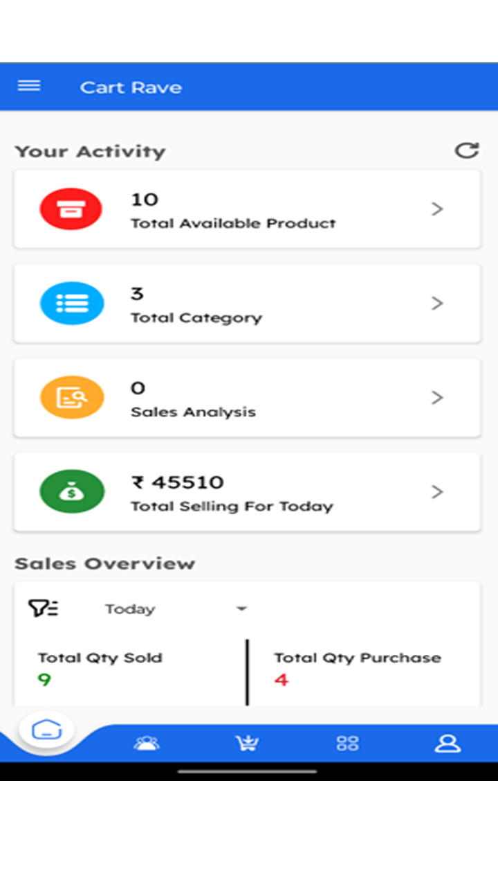
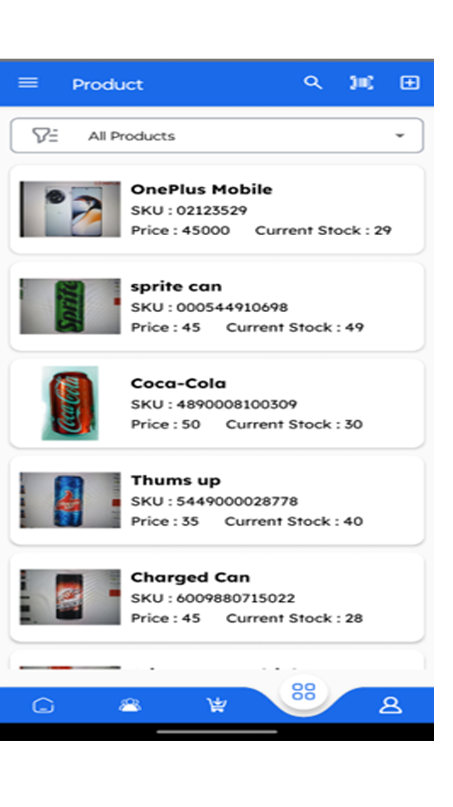
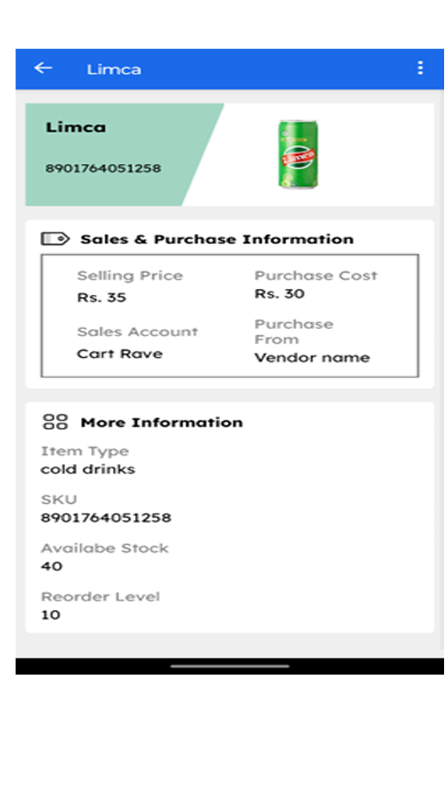
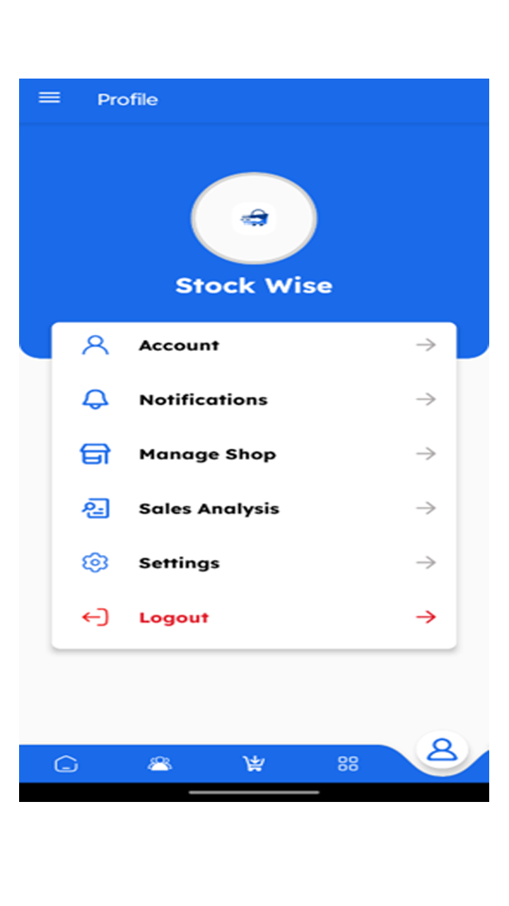
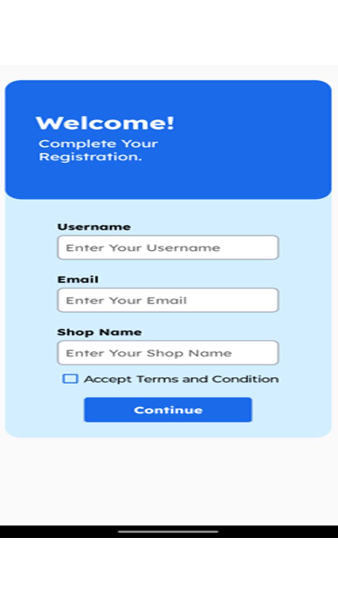

## 📦 StockWise - Smart Inventory Management for Small Shops

 <!-- Replace with your banner image path -->

> **StockWise** is an Android application designed to help small general shop owners manage their inventory with ease, accuracy, and speed. With features like barcode scanning, mobile authentication, and smart stock filtering, StockWise turns complex inventory tasks into a seamless experience.

---

### 📱 Preview

| Home Screen             | Product List             | Single Product            | Settings         |
| ----------------------- | ----------------------- | ----------------------- | ----------------------- |
|  |  |  |  |


---

### ✨ Features

* 📲 **Mobile OTP Verification** for secure login
* 📦 **Product & Vendor Management**
* 🧾 **Customer Records & Category Organization**
* 📸 **Barcode Scanning** to auto-fill product info
* 🔍 **Advanced Filtering** (out-of-stock, reorder level alerts)
* 👥 **User Profile Management**
* ☁️ **Firebase Realtime Sync** for data safety and fast access

---

### 🧰 Tech Stack

| Category         | Tools / Technologies                |
| ---------------- | ----------------------------------- |
| Language         | Java                                |
| Framework        | Android SDK                         |
| Backend/Database | Firebase (Auth, Firestore, Storage) |
| Version Control  | Git & GitHub                        |

---

### 🚀 Getting Started

1. **Clone the Repository**

```bash
git clone https://github.com/Pratham1803/StockWise.git
```

2. **Open in Android Studio**

3. **Connect Firebase**

   * Add your `google-services.json` to `app/` directory
   * Enable Firebase Authentication and Firestore in Firebase Console

4. **Run the App**

   * Build & run on an Android device or emulator

---

### 📱 Other Screens

| Registration             | Login Screen             | OTP Verification            
| ----------------------- | ----------------------- | ----------------------- | 
|  |  |  | 


---

### ⭐ Support

If you like this project, consider giving it a ⭐ and sharing it with others!

---